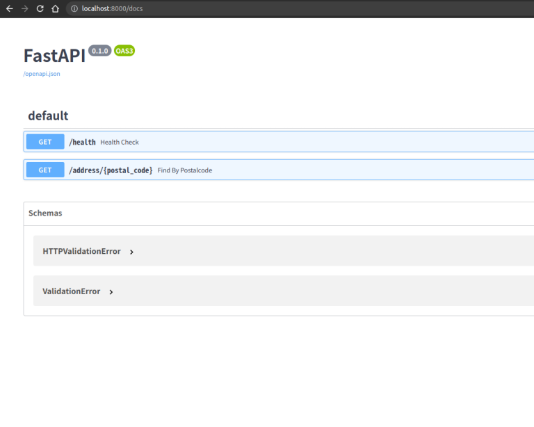

# pykenall

KenALL.CSV を JSON にして FastAPI でサーバーっぽく動かす例。

https://gist.github.com/grim13b/edd7c3be0d7350e926fb のブラッシュアップ版。

## 使い方

1. ./data に KEN_ALL.CSV を置く
2. `python utils/ken_all_parser.py` を実行して ./assets/ken_all.json を作る
3. `docker-compose up --build` で起動する
4. 任意の http クライアントで実行する
    - `GET localhost:8000/address/{postal_code}` で住所を取得する
        - `postal_code` は前方一致

## OpenAPI Document を表示する

URL: `localhost:8000/docs`

